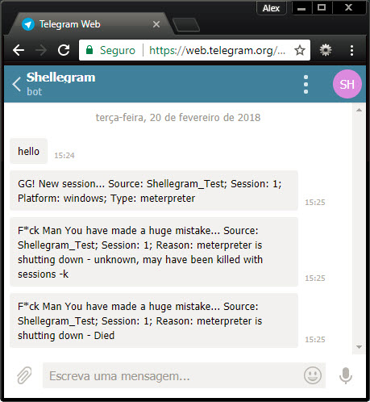

# Shellegram
This Metasploit plugin was created to monitor sessions, new ones and those closing in Telegram. The idea is to provide a way for consultants to see new sessions coming in when they might not have access to their listener(s). Perhaps you have stepped away from your computer with an active phishing campaign? Maybe you're using a Rubber Ducky in an office and want to get a mobile notification if your payload succeeds?

A future version use the Metasploit remote API to monitor sessions and Empire REST API to support both Meterpreter sessions and Empire agents.

Shellegram uses session subscriptions to monitor activity and then sends an message to Telegram using Bot. The alert is sent using the Telegram Bot API URL and a POST request and will send a message to specified chat_id (you could also use Telegram username to set chat_id) and provide the computer name of the server with the session (if set).

## Setup
Place the shellegram.rb file inside "/usr/share/metasploit-framework/plugins/" or a folder you have linked to this primary plugins folder (~/.msf4/plugins/).

Then create a new bot in Telegram, get the BOT-TOKEN, add that bot to your Telegram and send at least 2 messages to bot recognise you. See (https://core.telegram.org/bots#3-how-do-i-create-a-bot)

## Sample Usage
The Shellegram plugin can be used like any other Metasploit plugin. Begin by loading Shellegram and setting your options. Then you will need to config to subscribe to session events. See the following example:
<pre>
msf exploit(multi/handler) > load shellegram 
[*] Successfully loaded plugin: shellegram
msf exploit(multi/handler) > shellegram_set_bot_token BOT-TOKEN
[*] Setting the bot_token Telegram handle to BOT-TOKEN
msf exploit(multi/handler) > shellegram_set_user USERNAME
[*] Setting the user to USERNAME
msf exploit(multi/handler) > shellegram_set_chat_id_by_user
[*] Setting the chat_id to CHAT-ID
msf exploit(multi/handler) > shellegram_set_source Shellegram_Test
[*] Setting the source to Shellegram_Test
msf exploit(multi/handler) > shellegram_save
[*] Saving options to config file
[+] All settings saved to ~/.msf4/Shellegram.yaml
msf exploit(multi/handler) > shellegram_test
[*] Sending tests message
[+] message sent =)
msf exploit(multi/handler) > shellegram_start
[*] Session activity will be sent to you via Telegram API, chat_id: CHAT-ID
[+] Shellegram Plugin Started, Monitoring Sessions
msf exploit(multi/handler) > 
[*] https://172.16.9.15:8443 handling request from 172.16.9.198; (UUID: a5tbn78w) Staging x86 payload (180825 bytes) ...
[*] Meterpreter session 1 opened (172.16.9.15:8443 -> 172.16.9.198:30709) at 2018-02-20 15:25:19 -0300
[*] GG! New session... Source: Shellegram_Test; Session: 1; Platform: windows; Type: meterpreter

msf exploit(multi/handler) > sessions -K
[*] Killing all sessions...
[*] 172.16.9.198 - Meterpreter session 1 closed.
[*] F*ck Man You have made a huge mistake... Source: Shellegram_Test; Session: 1; Reason: meterpreter is shutting down - unknown, may have been killed with sessions -k
[*] 172.16.9.198 - Meterpreter session 1 closed.  Reason: Died
[*] F*ck Man You have made a huge mistake... Source: Shellegram_Test; Session: 1; Reason: meterpreter is shutting down - Died
msf exploit(multi/handler) > shellegram_stop 
[*] Stopping the monitoring of sessions to Telegram
</pre>

This is how message are send to your Telegram Bot

If you have any questions, use help shellegram:

shellegram Commands
===================

    Command                         Description
    -------                         -----------
    shellegram_help                 Displays help.
    shellegram_save                 Save Settings to YAML File ~/.msf4/Shellegram.yaml.
    shellegram_set_bot_token        Set Telegram bot_token for messages.
    shellegram_set_chat_id          Set Telegram chat_id for messages.
    shellegram_set_chat_id_by_user  Use currently user whith bot_token to get chat_id.
    shellegram_set_source           Set source for identifying the source of the message.
    shellegram_set_user             Set your telegram userid to get chat_id.
    shellegram_show_options         Shows currently set parameters.
    shellegram_start                Start Shellegram Plugin after saving settings.
    shellegram_stop                 Stop monitoring for new sessions.
    shellegram_test                 Send test message to make sure confoguration is working.

